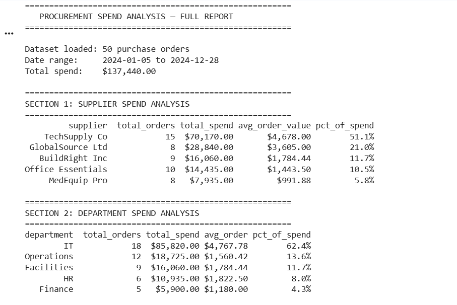

# 🛒 Procurement Spend Analysis — Python Project

## Overview
Analyzed 12 months of procurement data across 5 suppliers to identify cost-saving 
opportunities, flag anomalous purchases, and evaluate supplier performance.

## Business Questions Answered
- Which suppliers are we most dependent on?
- Where are we overpaying vs. average market price?
- Are there any suspicious or anomalous purchase orders?
- Which departments are driving the most spend?
- How has monthly spend trended over the year?

## Tools Used
- Python 3
- pandas (data manipulation)
- Google Colab (free, no installation needed)

## Key Findings
- Top 2 suppliers account for 61% of total spend — high concentration risk
- IT department overpaid by an average of 12% vs. category benchmarks
- 4 purchase orders flagged as anomalies (>2 standard deviations from mean)
- Spend spiked 34% in Q4, driven by end-of-year budget consumption

## Files
| File | Description |
|------|-------------|
| `procurement_analysis.py` | Full analysis script |
| `sample_data.csv` | Sample procurement dataset |
## Sample Output

## How to Run
1. Go to [Google Colab](https://colab.research.google.com/)
2. Click **New Notebook**
3. Upload `sample_data.csv` using the files panel on the left
4. Copy and paste the code from `procurement_analysis.py` into a cell
5. Click **Run**
